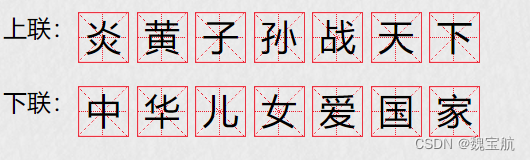
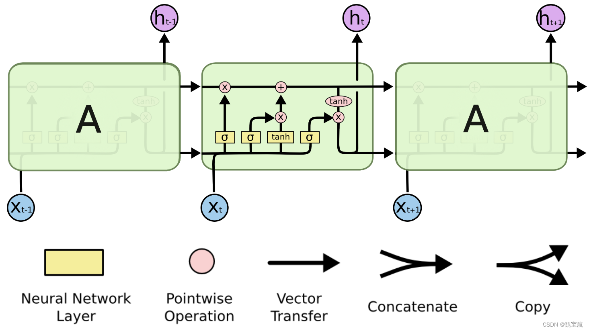
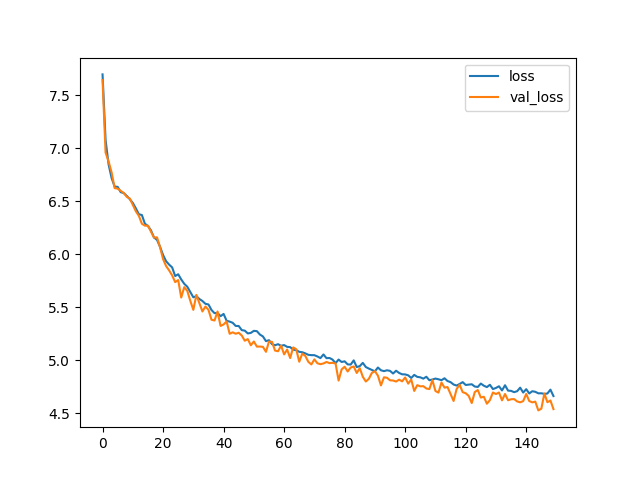

# 基于LSTM实现春联上联对下联

参考资料：

https://blog.csdn.net/m0_47256162/article/details/127206450?spm=1001.2014.3001.5501

Kiperwasser E, Goldberg Y. Simple and accurate dependency parsing using bidirectional LSTM feature representations[J].
Transactions of the Association for Computational Linguistics, 2016, 4: 313-327.

本项目采用LSTM实现春联上联对下联，


## 数据集

该数据集包含了超过70万副的中文对联数据。数据集包含4个文件：

- train_in.txt: 对联的上联。每行都是一个输入，每个词都用空格隔开。(训练集的输入)
- train_out.txt:对联的下联。每行都是一个输出。对应着 train_in.txt的每一行。每个词都用空格隔开。 (训练集的输出)
- test_in.txt : 对联的上联。每行都是一个输入，每个词都用空格隔开。(测试集的输入)
- test_out.txt : 对联的下联。每行都是一个输出。对应着 test_in.txt的每一行。每个词都用空格隔开。 (测试集的输出)


数据来源自：https://www.heywhale.com/mw/dataset/5c46e6f42d8ef5002b736d6d/content

## 网络结构



项目中使用的模型是LSTM，在模型中我们定义了三个组件，分别是embedding层，lstm层和全连接层。

- Embedding层：将每个词生成对应的嵌入向量，就是利用一个连续型向量来表示每个词
- Lstm层：提取语句中的语义信息
- Linear层：将结果映射成vocab_size大小用于多分类，即每个字的概率

```python
class LSTM(nn.Module):
    def __init__(self, vocab_size, embedding_dim, hidden_dim, num_layers):
        super(LSTM, self).__init__()
        self.hidden_dim = hidden_dim
        self.embeddings = nn.Embedding(vocab_size, embedding_dim)
        self.lstm = nn.LSTM(embedding_dim, hidden_dim, num_layers, dropout=0.5)
        self.linear = nn.Linear(hidden_dim, vocab_size)

    def forward(self, x):
        time_step, batch_size = x.size()
        embeds = self.embeddings(x)
        output, (h_n, c_n) = self.lstm(embeds)
        output = self.linear(output.reshape(time_step * batch_size, -1))
        # 要返回所有时间点的数据，每个时间点对应一个字，也就是vocab_size维度的向量
        return output
```

## 数据预处理

由于测试集会出现训练集中的未登陆词，在词汇表中新增一个UNK标记，作为未登录词。在训练时根据词频$f(\omega)$，当$f(\omega)>2$时，采用$z/(z+f(\omega))$的概率把词随机变为UNK，$z$通常为0.8375

```python
for sent in x:
    word_arr = []
    for word in sent:
        # liyahu Kiperwasser and Yoav Goldberg. 2016b
        if word_freq_dict[word] > 2:
            pro = 0.8375 / (0.8375 + word_freq_dict[word])
            if random.random() < pro:
                word = 'UNK'
        word_arr.append(word2idx[word])
    train_x.append(word_arr)
for sent in y:
    word_arr = []
    for word in sent:
        # liyahu Kiperwasser and Yoav Goldberg. 2016b
        if word_freq_dict[word] > 2:
            pro = 0.8375 / (0.8375 + word_freq_dict[word])
            if random.random() < pro:
                word = 'UNK'
        word_arr.append(word2idx[word])
    train_y.append(word_arr)
```

## 训练结果
运行train.py训练模型，训练设备采用 NVIDIA GeForce RTX 3050 4GB Laptop GPU


## demo展示
利用Flask框架，将项目部署在云服务器上，访问地址为：http://121.40.230.232:5000/ 
```python
import json
import torch
import numpy as np
from flask import Flask, render_template, request

app = Flask(__name__)
# 春联匹配函数
def couplet_match(s, device='cpu'):
    # 将字符串转为数值
    with open('./save/word2idx.json', 'r') as f:
        word2idx = json.load(f)
    with open('./save/idx2word.json', 'r') as f:
        idx2word = json.load(f)
    model_path = './save/best_model.pt'
    model = torch.load(model_path)
    model.to(device)
    x = [word2idx[word] for word in s]

    # 将数值向量转为tensor
    x = torch.from_numpy(np.array(x).reshape(-1, 1))

    y = model(x)
    y = y.argmax(axis=1)
    # r = ''.join([idx2word.get(str(idx.item())) for idx in y])
    r = ''
    for idx in y:
        word = idx2word.get(str(idx.item()))
        if word == "UNK":
            word = idx2word.get(str(np.random.randint(0, len(idx2word) - 1)))
        r += word
    print('上联：%s，下联：%s' % (s, r))
    return r

@app.route("/", methods=["GET"])
def index():
    return render_template("index.html")

@app.route("/execute_function", methods=["POST"])
def execute_function():
    data = request.json
    function_name = data["function_name"]
    input_text = data["input_text"]
    result = ""
    if function_name == "analyze":
        result = couplet_match(input_text)
    return result

if __name__ == "__main__":
    app.run(host='0.0.0.0', port=5000, debug=True)
```
运行展示：

