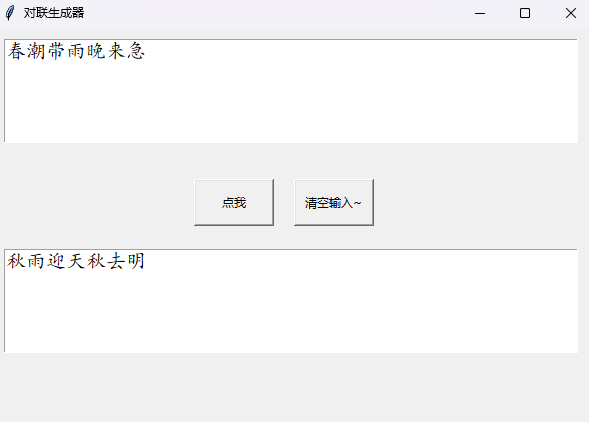
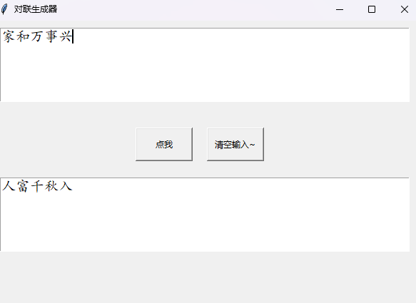

# 基于LSTM实现春联上联对下联

参考资料：

https://blog.csdn.net/m0_47256162/article/details/127206450?spm=1001.2014.3001.5501

Kiperwasser E, Goldberg Y. Simple and accurate dependency parsing using bidirectional LSTM feature representations[J].
Transactions of the Association for Computational Linguistics, 2016, 4: 313-327.

本项目采用LSTM实现春联上联对下联，


## 数据集

该数据集包含了超过70万副的中文对联数据。数据集包含4个文件：

- train_in.txt: 对联的上联。每行都是一个输入，每个词都用空格隔开。(训练集的输入)
- train_out.txt:对联的下联。每行都是一个输出。对应着 train_in.txt的每一行。每个词都用空格隔开。 (训练集的输出)
- test_in.txt : 对联的上联。每行都是一个输入，每个词都用空格隔开。(测试集的输入)
- test_out.txt : 对联的下联。每行都是一个输出。对应着 test_in.txt的每一行。每个词都用空格隔开。 (测试集的输出)


数据来源自：https://www.heywhale.com/mw/dataset/5c46e6f42d8ef5002b736d6d/content

## 网络结构


项目中使用的模型是LSTM，在模型中我们定义了三个组件，分别是embedding层，lstm层和全连接层。

- Embedding层：将每个词生成对应的嵌入向量，就是利用一个连续型向量来表示每个词
- Lstm层：提取语句中的语义信息
- Linear层：将结果映射成vocab_size大小用于多分类，即每个字的概率

```python
class LSTM(nn.Module):
    def __init__(self, vocab_size, embedding_dim, hidden_dim, num_layers):
        super(LSTM, self).__init__()
        self.hidden_dim = hidden_dim
        self.embeddings = nn.Embedding(vocab_size, embedding_dim)
        self.lstm = nn.LSTM(embedding_dim, hidden_dim, num_layers, dropout=0.5)
        self.linear = nn.Linear(hidden_dim, vocab_size)

    def forward(self, x):
        time_step, batch_size = x.size()
        embeds = self.embeddings(x)
        output, (h_n, c_n) = self.lstm(embeds)
        output = self.linear(output.reshape(time_step * batch_size, -1))
        # 要返回所有时间点的数据，每个时间点对应一个字，也就是vocab_size维度的向量
        return output
```

## 数据预处理

由于测试集会出现训练集中的未登陆词，在词汇表中新增一个UNK标记，作为未登录词。在训练时根据词频$f(\omega)$，当$f(\omega)>2$时，采用$z/(z+f(\omega))$的概率把词随机变为UNK，$z$通常为0.8375

```python
for sent in x:
    word_arr = []
    for word in sent:
        # liyahu Kiperwasser and Yoav Goldberg. 2016b
        if word_freq_dict[word] > 2:
            pro = 0.8375 / (0.8375 + word_freq_dict[word])
            if random.random() < pro:
                word = 'UNK'
        word_arr.append(word2idx[word])
    train_x.append(word_arr)
for sent in y:
    word_arr = []
    for word in sent:
        # liyahu Kiperwasser and Yoav Goldberg. 2016b
        if word_freq_dict[word] > 2:
            pro = 0.8375 / (0.8375 + word_freq_dict[word])
            if random.random() < pro:
                word = 'UNK'
        word_arr.append(word2idx[word])
    train_y.append(word_arr)
```

## 完整代码
```python
# -----------------------dataprocessor.py-----------------------

# 加载文本数据
import codecs
import random

import numpy as np
import torch
import json

# 用于生成训练数据
def data_generator(data, batch_size, max_len):
    # 计算每个对联长度的权重
    data_probability = [float(len(x)) for wordcount, [x, y] in data.items()]  # [每个字数key对应对联list中上联数据的个数]
    data_probability = np.array(data_probability) / sum(data_probability)  # 标准化至[0,1]，这是每个字数的权重

    # 随机选择字数，然后随机选择字数对应的上联样本，生成batch
    for idx in range(max_len):
        # 随机选字数id，概率为上面计算的字数权重
        idx = idx + 1
        try:
            size = min(batch_size, len(data[idx][0]))  # batch_size=64，len(data[idx][0])随机选择的字数key对应的上联个数
        except:
            continue
        # 从上联列表下标list中随机选出大小为size的list
        idxs = np.random.choice(len(data[idx][0]), size=size)

        # 返回选出的上联X与下联y, 将原本1-d array维度扩展为(row,col,1)
        yield data[idx][0][idxs], np.expand_dims(data[idx][1][idxs], axis=2)

# 数据读取与切分
def read_data(file_path):
    txt = codecs.open(file_path, encoding='utf-8').readlines()
    txt = [line.strip().split(' ') for line in txt]  # 每行按空格切分
    txt = [line for line in txt if len(line) < 34]  # 过滤掉字数超过maxlen的对联
    max_len = max([len(i) for i in txt])
    return txt, max_len

# 产生数据字典
def generate_count_dict(result_dict, x, y):
    for i, idx in enumerate(x):
        j = len(idx)
        if j not in result_dict:
            result_dict[j] = [[], []]  # [样本数据list,类别标记list]
        result_dict[j][0].append(idx)
        result_dict[j][1].append(y[i])
    return result_dict

# 将字典数据转为numpy
def to_numpy_array(dict):
    for count, [x, y] in dict.items():
        dict[count][0] = np.array(x)
        dict[count][1] = np.array(y)

    return dict

def load_test_data(input_path, output_path, word2idx):
    x, _ = read_data(input_path)
    y, _ = read_data(output_path)
    test_x = []
    test_y = []
    for i, item in enumerate(x):
        word_x = []
        word_y = []
        for word in x[i]:
            try:
                word_x.append(word2idx[word])
            except:
                word_x.append(word2idx['UNK'])
        for word in y[i]:
            try:
                word_y.append(word2idx[word])
            except:
                word_y.append(word2idx['UNK'])
        test_x.append(word_x)
        test_y.append(word_y)
    test_dict = {}

    test_dict = generate_count_dict(test_dict, test_x, test_y)

    test_dict = to_numpy_array(test_dict)
    return test_dict

def load_data(input_path, output_path):

    x, max_len = read_data(input_path)
    y, max_len = read_data(output_path)

    # 获取词表
    vocabulary = x + y
    word_freq_dict = {}
    for words in vocabulary:
        for word in words:
            if word not in word_freq_dict:
                word_freq_dict[word] = 0
        word_freq_dict[word] += 1


    word_freq_dict_list = sorted(word_freq_dict.items(), key=lambda x: x[1], reverse=True)
    word2idx = {}
    idx2word = {}
    for word, freq in word_freq_dict_list:
        curr_id = len(word2idx)
        word2idx[word] = curr_id
        idx2word[curr_id] = word

    # 训练数据中所有词的个数
    vocab_size = len(word2idx.keys())  # 词汇表大小
    word2idx['UNK'] = vocab_size
    idx2word[vocab_size] = 'UNK'
    with open('./save/word2idx.json', 'w', encoding='utf-8') as f:
        json.dump(word2idx, f)
    with open('./save/idx2word.json', 'w', encoding='utf-8') as f:
        json.dump(idx2word, f)
    # 将x和y转为数值
    train_x = []
    train_y = []
    for sent in x:
        word_arr = []
        for word in sent:
            # liyahu Kiperwasser and Yoav Goldberg. 2016b
            if word_freq_dict[word] > 2:
                pro = 0.8375 / (0.8375 + word_freq_dict[word])
                if random.random() < pro:
                    word = 'UNK'
            word_arr.append(word2idx[word])
        train_x.append(word_arr)
    for sent in y:
        word_arr = []
        for word in sent:
            # liyahu Kiperwasser and Yoav Goldberg. 2016b
            if word_freq_dict[word] > 2:
                pro = 0.8375 / (0.8375 + word_freq_dict[word])
                if random.random() < pro:
                    word = 'UNK'
            word_arr.append(word2idx[word])
        train_y.append(word_arr)


    train_dict = {}

    train_dict = generate_count_dict(train_dict, train_x, train_y)

    train_dict = to_numpy_array(train_dict)

    return train_dict, vocab_size + 1, idx2word, word2idx, max_len

# -----------------------model.py-----------------------

import random

import torch
from torch import nn

# 定义网络结构
class LSTM(nn.Module):
    def __init__(self, vocab_size, embedding_dim, hidden_dim, num_layers):
        super(LSTM, self).__init__()
        self.hidden_dim = hidden_dim
        self.embeddings = nn.Embedding(vocab_size, embedding_dim)
        self.lstm = nn.LSTM(embedding_dim, hidden_dim, num_layers, dropout=0.5)
        self.linear = nn.Linear(hidden_dim, vocab_size)

    def forward(self, x):
        time_step, batch_size = x.size()
        embeds = self.embeddings(x)
        output, (h_n, c_n) = self.lstm(embeds)
        output = self.linear(output.reshape(time_step * batch_size, -1))
        # 要返回所有时间点的数据，每个时间点对应一个字，也就是vocab_size维度的向量
        return output

# -----------------------run.py-----------------------

import numpy as np
import torch
from torch import nn
from torch import optim
from torchnet import meter
from dataprocessor import *
from model import *
import os
import matplotlib.pyplot as plt

# 模型输入参数，需要自己根据需要调整
input_path = './data/train_in.txt'
output_path = './data/train_out.txt'
test_input_path = './data/test_in.txt'
test_output_path = './data/test_out.txt'

num_layers = 3  # LSTM层数
hidden_dim = 512  # LSTM中的隐层大小
epochs = 150  # 迭代次数
batch_size = 256  # 每个批次样本大小
embedding_dim = 128  # 每个字形成的嵌入向量大小
lr = 0.001 # 学习率
device = 'cpu'
device = torch.device('cuda' if torch.cuda.is_available() else 'cpu')

train_dict, vocab_size, idx2word, word2idx, max_len = load_data(input_path, output_path)
# 模型训练
model = LSTM(vocab_size=vocab_size, hidden_dim=hidden_dim,
             embedding_dim=embedding_dim, num_layers=num_layers)

best_model = LSTM(vocab_size=vocab_size, hidden_dim=hidden_dim,
             embedding_dim=embedding_dim, num_layers=num_layers)


optimizer = optim.Adam(model.parameters(), lr=lr)
criterion = nn.CrossEntropyLoss()
model.to(device)
loss_meter = meter.AverageValueMeter()
best_loss = float('inf')
val_loss_meter = meter.AverageValueMeter()

loss_arr = []
val_loss_arr = []

for epoch in range(epochs):
    loss_meter.reset()
    val_loss_meter.reset()
    for x, y in data_generator(train_dict, batch_size=batch_size, max_len=max_len):
        model.train()
        idxs = np.random.choice(len(x), size=max(int(len(x)*0.1), 1))

        valid_x = torch.from_numpy(x.copy()[idxs]).long().transpose(1, 0).contiguous()
        valid_y = torch.from_numpy(y.copy()[idxs]).long().transpose(1, 0).contiguous()
        valid_x = valid_x.to(device)
        valid_y = valid_y.to(device)

        train_x = torch.from_numpy(np.delete(x, idxs, 0)).long().transpose(1, 0).contiguous()
        train_x = train_x.to(device)

        train_y = torch.from_numpy(np.delete(y, idxs, 0)).long().transpose(1, 0).contiguous()
        train_y = train_y.to(device)

        optimizer.zero_grad()

        output_ = model(train_x)

        loss = criterion(output_, train_y.long().view(-1))
        loss.backward()

        optimizer.step()
        loss_meter.add(loss.item())
        model.eval()
        # valid_x = train_x[idxs]
        # valid_y = train_y[idxs]
        try:
            output_ = model(valid_x)
        except:
            print(111)
        val_loss = criterion(output_, valid_y.long().view(-1))
        val_loss_meter.add(val_loss.item())

    # 打印信息
    print("【EPOCH:     】%s" % str(epoch + 1))
    print("【Train Loss:】%s" % (str(loss_meter.mean)))
    print("【Valid Loss:】%s" % (str(val_loss_meter.mean)))
    loss_arr.append(loss_meter.mean)
    val_loss_arr.append(val_loss_meter.mean)
    # 保存模型及相关信息
    if val_loss_meter.mean < best_loss:
        best_loss = val_loss_meter.mean
        best_model.load_state_dict(model.state_dict())

    # 在训练结束保存最优的模型参数
    if epoch == epochs - 1:
        # 保存模型
        torch.save(best_model,
                   './save/best_model.pt')
plt.plot(loss_arr, label='loss')
plt.plot(val_loss_arr, label='val_loss')
plt.legend()
plt.savefig('./save/loss.png')

test_dict = load_test_data(test_input_path, test_output_path, word2idx)
best_model.to(device)
best_model.eval()
loss_meter.reset()
for x, y in data_generator(test_dict, batch_size=batch_size, max_len=max_len):
    x = torch.from_numpy(x).long().transpose(1, 0).contiguous()
    x = x.to(device)
    y = torch.from_numpy(y).long().transpose(1, 0).contiguous()
    y = y.to(device)
    output_ = best_model(x)
    loss = criterion(output_, y.long().view(-1))
    loss_meter.add(loss.item())

print("【Test Loss:】%s" % (str(loss_meter.mean)))

# -----------------------UI.py-----------------------

# 设计UI界面

import json
import tkinter as tk
import torch
import numpy as np
from model import *
def couplet_match(s, device='cpu'):
    # 将字符串转为数值
    with open('./save/word2idx.json', 'r') as f:
        word2idx = json.load(f)
    with open('./save/idx2word.json', 'r') as f:
        idx2word = json.load(f)
    model_path = './save/best_model.pt'
    model = torch.load(model_path)
    model.to(device)
    x = [word2idx[word] for word in s]

    # 将数值向量转为tensor
    x = torch.from_numpy(np.array(x).reshape(-1, 1))

    y = model(x)
    y = y.argmax(axis=1)
    r = ''.join([idx2word.get(str(idx.item())) for idx in y])

    print('上联：%s，下联：%s' % (s, r))
    return r


def insert_point():
    var = e.get('0.0', 'end')
    var = var.strip()
    # print('hhhh',var,type(var))
    second = couplet_match(var)
    # ee.insert('end',str(tensor))
    t.delete('1.0', 'end')
    t.insert('end', second)


def delet():
    e.delete('1.0', 'end')

window = tk.Tk()
window.title('对联生成器')
window.geometry('600x400')
b1 = tk.Button(window, text='点我', width=10,
               height=2, command=insert_point)
b1.place(x=200,y=150)

b2 = tk.Button(window, text='清空输入~', width=10,
               height=2, command=delet)
b2.place(x=300,y=150)

e = tk.Text(window,width=57,height=5,font=('楷体', 15), show = None)#显示成明文形式
e.place(x=10,y=10)

t = tk.Text(window,width=57, height=5,font=('楷体', 15))
t.place(x=10,y=220)

window.mainloop()
```

## 训练结果


## demo展示
运行UI.py，输入上联对下联

